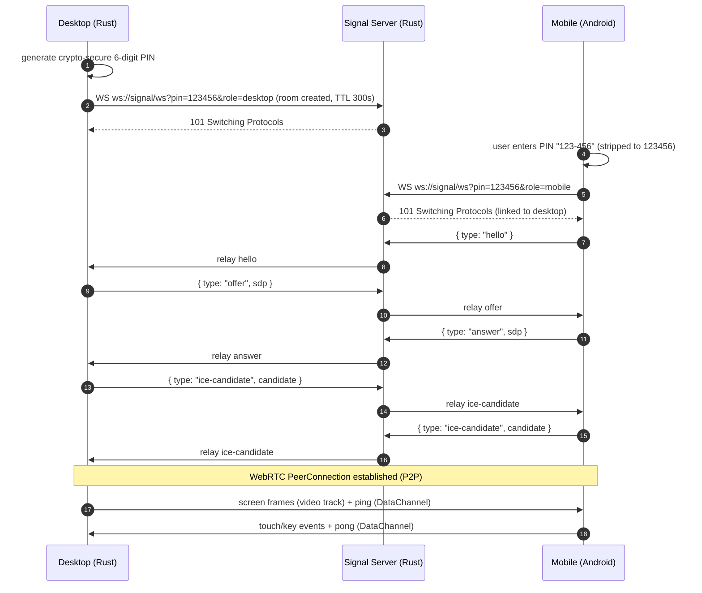

# Handshake Sequence

## Notes

- The Signal server only relays; it never echoes a message back to its sender.
- The desktop is the WebRTC **offerer**: it waits for the mobile `hello`
  before creating the offer.
- Rooms carry a TTL of 300 seconds from the first join and are swept by a
  background cleaner; a room is removed when both peers disconnect or the
  TTL elapses.
- Once the `PeerConnection` is up, all media and input traffic is P2P and no
  longer touches the Signal server.
