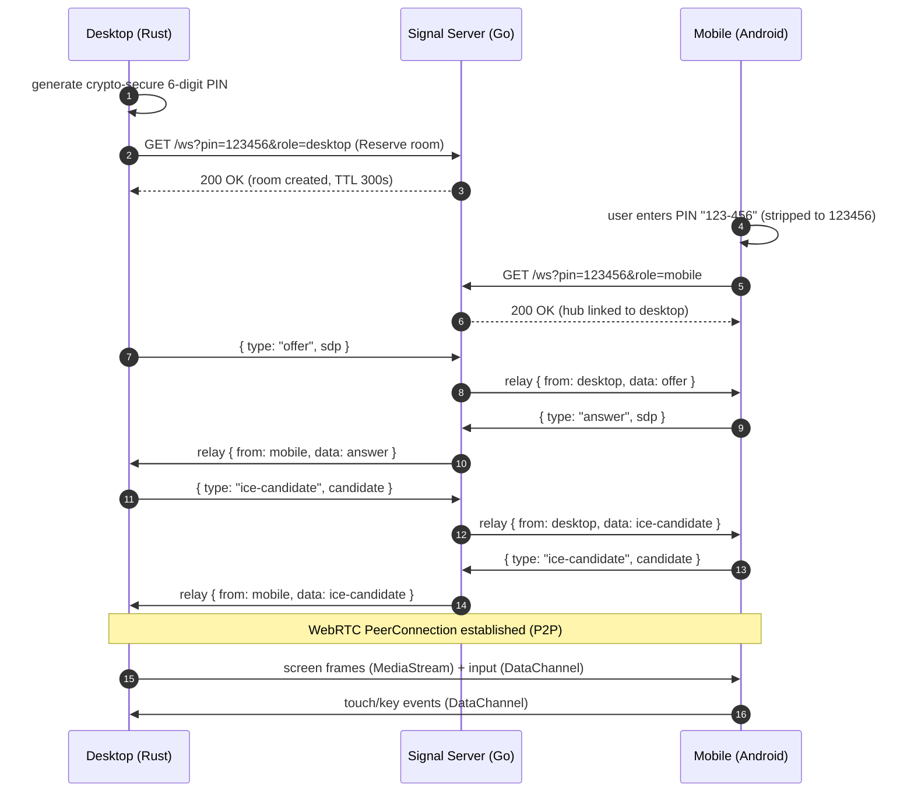

# Handshake Sequence

## Notes

- The Signal server only relays; it never echoes a message back to its sender.
- Each relayed message refreshes the room TTL, so an active session does not
  expire.
- Once the `PeerConnection` is up, all media and input traffic is P2P and no
  longer touches the Signal server.
